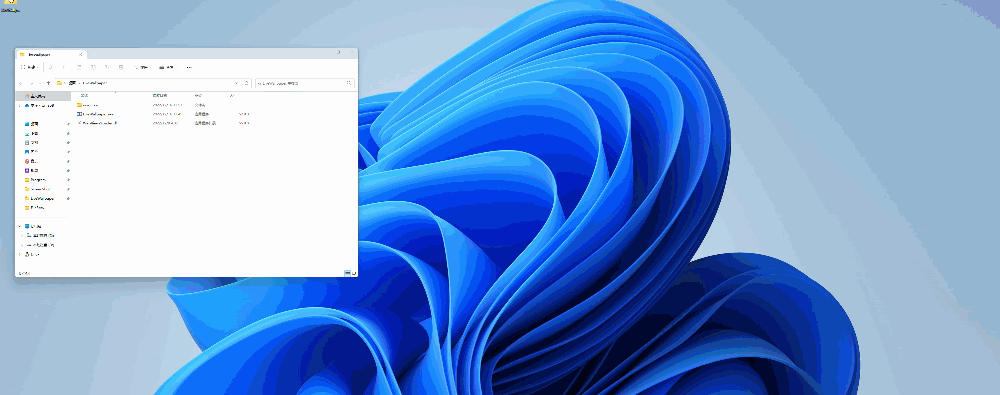

# LiveWallpaper

用 **WebView2** 实现的动态壁纸程序，支持 `html` 文件。

实现效果（以 <code>demo1</code> 为例）

## 下载

[https://github.com/lihaoze123/LiveWallpaper/releases](https://github.com/lihaoze123/LiveWallpaper/releases)

## 运行

双击 `LiveWallpaper.exe` 文件直接运行，修改 `resource/wallpaper.html` 文件以达到更多效果。

可以通过组合键 <kbd>Win</kbd>+<kbd>Esc</kbd> 结束程序

## 构建

请首先确保已安装 **Visual Studio 2022**，然后按照 **WebView2** [官方指南 ](https://learn.microsoft.com/en-us/microsoft-edge/webview2/get-started/win32)安装依赖库 `Microsoft.Web.WebView2` 以及 `Microsoft.Windows.ImplementationLibrary` ，双击 `LiveWallpaper.sln` 以编译。

如需在 **Visual Studio** 内调试，请将 `html` 文件置于 `/LiveWallpaper/resource` 文件夹内，并重命名为 `wallpaper.html`。

